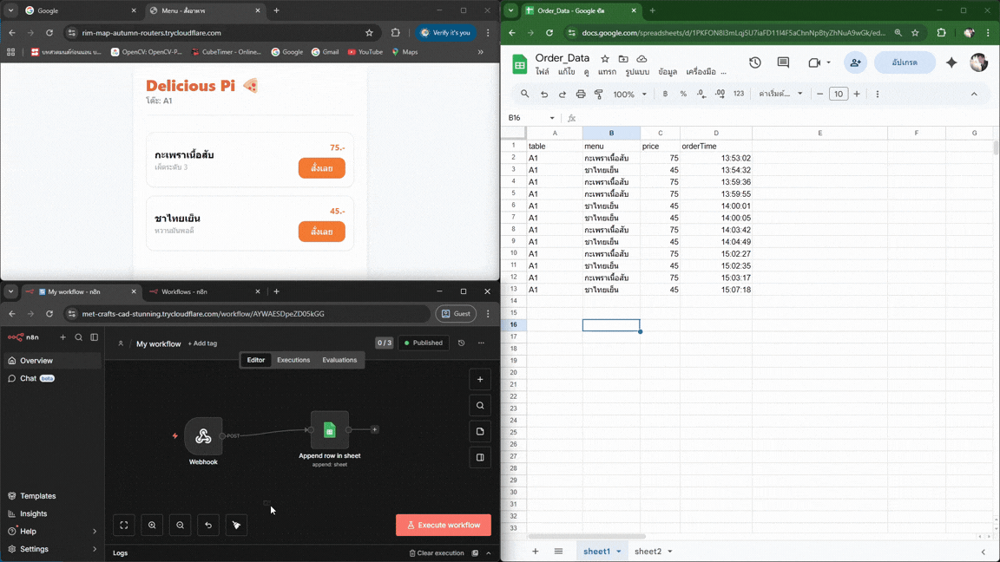

## 🚀 System Showcase
ด้านล่างนี้คือการสาธิตการทำงานจริงของระบบ (End-to-End Automation):
- **Frontend:** ลูกค้าสั่งอาหารผ่าน Web Interface
- **Automation:** n8n รับข้อมูลผ่าน Webhook และทำการประมวลผล JSON Data
- **Database:** บันทึกข้อมูลลง Google Sheets แบบเรียลไทม์

  

Project Overview: ระบบสั่งอาหารอัตโนมัติที่ช่วยลดขั้นตอนการคีย์ข้อมูลด้วยมือ (Manual)

Tech Stack:

Frontend: HTML/JS (Mobile Friendly)

Backend/Automation: n8n

Database: Google Sheets API

Infrastructure: Raspberry Pi 4, Docker, Cloudflare Tunnel
